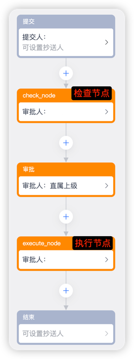
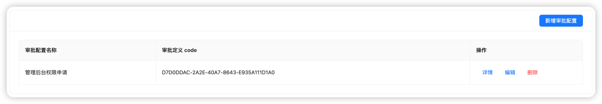
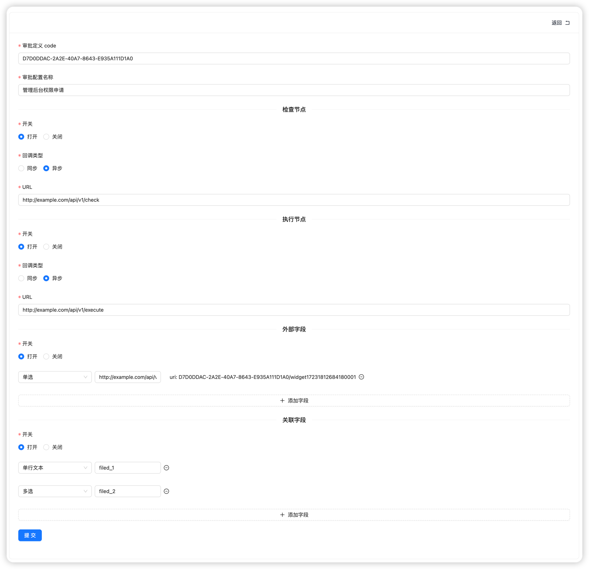

<div align="center">
    <h1>lark-ticket</h1>
    
    <p align="center">
        
        <a href="https://github.com/astral-sh/ruff"></a>
    </p>
</div>

> lark-ticket 是「飞书」工单的增强功能。增加审批单提交时检查、结束时调用 API、审批字段转 API 字段等功能。

## 为什么会有这个项目？
### 1. 无检查、执行节点
举个 🌰【管理后台权限申请】

原始流程。
```
提交审批
  ↓
审批中
  ↓
审批完成
  ↓
API 执行
```

存在的问题:
- 如果已经拥有权限就不必申请了，但是没有办法阻断
- API 执行失败也无法让用户感知
- 整个流程无法形成完整闭环

接入`lark-ticket`后的流程。
```
提交审批
  ↓
检查节点
  ↓
  ├─> 检查成功
  │     ↓
  │   审批中
  │     ↓
  │   审批完成
  │     ↓
  │   执行节点
  │     ├─> 执行成功
  │     │     ↓
  │     │   审批完成
  │     └─> 执行失败
  │           ↓
  │         拒绝申请
  └─> 检查失败
        ↓
      拒绝申请
```

### 2. 审批字段与 API 字段对应问题
审批回调提供的字段信息仅有中文名和组件的 ID。需要每一个业务方去适配，需要维护一个对应关系。而接入`lark-ticket`后所有业务方仅需要提供标准的`API`接口。`lark-ticket`会维护所有的对应关系。

### 3. 迁移问题
永远不变的就只有变化，没办法保证会一直使用飞书。愿景是后续还有`dingtalk-ticket`、`wechat-ticket`，如果遇到需要切换`IM`的场景，业务方不需要改变任何东西，中间层切换即可，极大的减少了迁移成本。


## 必要配置

### 开发者后台
假设你的域名是`$domain`。

#### 事件回调
新建任意应用后，需要在开发者后台【开发配置】→【事件与回调】→【事件配置】中配置订阅地址，完整`url`是
```
$domain/api/v1/lark/callback
```

#### 事件
```
审批任务状态变更v1.0
```

#### 所需权限
```
访问审批应用  -  approval:approval:readonly
查看、创建、更新、删除审批应用相关信息  -  approval:approval
查看、创建、更新、删除原生审批定义相关信息  -  approval:definition
```

### 审批配置
#### ③ 流程设计
必须保证检查节点和执行节点在流程的开头和结尾。



注册一个【审批助手】的飞书账号。将【检查节点】和【执行节点】的审批人设置为【审批助手】。审批节点的名字默认是`check_node`和`execute_node`可以通过`const.py`文件来修改值。
```
# 检查节点名称
LARK_CHECK_NODE_NAME = "check_node"
# 执行节点名称
LARK_EXECUTE_NODE_NAME = "execute_node"
```

#### ④ 更多设置
将【审批人去重】修改为【仅针对连续审批的节点自动同意】。

## 配置文件

默认文件模版在`backend/etc/lark-ticket.conf`。

### 基础配置
```
[BASIC]
app_name       -- 项目名称
host           -- 监听地址
port           -- 监听端口号
workers_count  -- 进程数
debug          -- 是否开启 debug 模式
```

### 日志配置
```
[LOGURU]
path      -- 日志存放路径
filename  -- 日志文件名
level     -- 日志收集级别
rotation  -- 切分文件阈值
format    -- 日志格式 
```

### 数据库配置
数据库需要手动创建，表会自动创建。
```
[MYSQL]
scheme    -- 模式
host      -- ip 地址
port      -- 端口号
user      -- 用户名
password  -- 密码
db        -- 数据库
```

### 锁配置
```
[SCHEDULERLOCK]
host  -- ip 地址
port  -- 端口号
```

### 飞书配置
```
[LARK]
assistant_user_id   -- 审批助手 user id
app_id              -- 开发者后台获取
app_secret          -- 开发者后台获取
encrypt_key         -- 开发者后台获取
verification_token  -- 开发者后台获取
```

### 报警配置
```
[ALARM]
open               -- 开关
notification_type  -- 类型
sentry_dsn         -- dsn
```

## 界面

### 首页


### 详情页

其中外部字段的`uri`拼接域名后放在飞书审批配置的外部选项中。
```
$domain/field/$uri
```


## API
回调结构
```json
{
    "ticket_id": "str: 工单 id",
    "result": "bool: 检查或执行结果: True 成功 False 失败",
    "msg": "成功提示消息",
    "error": "错误信息"
}
```
同步方式调用必须满足该格式，异步方式回调时必须满足该格式。

### 检查节点回调地址
```
$domain/api/v1/lark/check/callback
```

### 执行节点回调地址
```
$domain/api/v1/lark/execute/callback
```

## 开发

### 后端
安装依赖
```
rye sync
```
启动项目
```
rye run dev
```
格式化代码、静态语法检查
```
rye run lint
```

### 前端
安装依赖
```
pnpm install
```
启动项目
```
pnpm run dev
```
打包
```
pnpm build
```

## License

[MIT License](https://github.com/mydevops/lark-ticket/blob/main/LICENSE)
